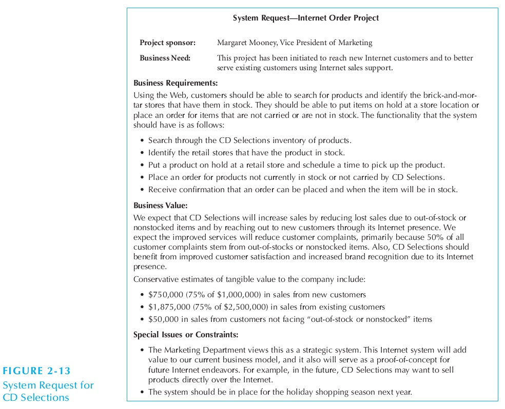
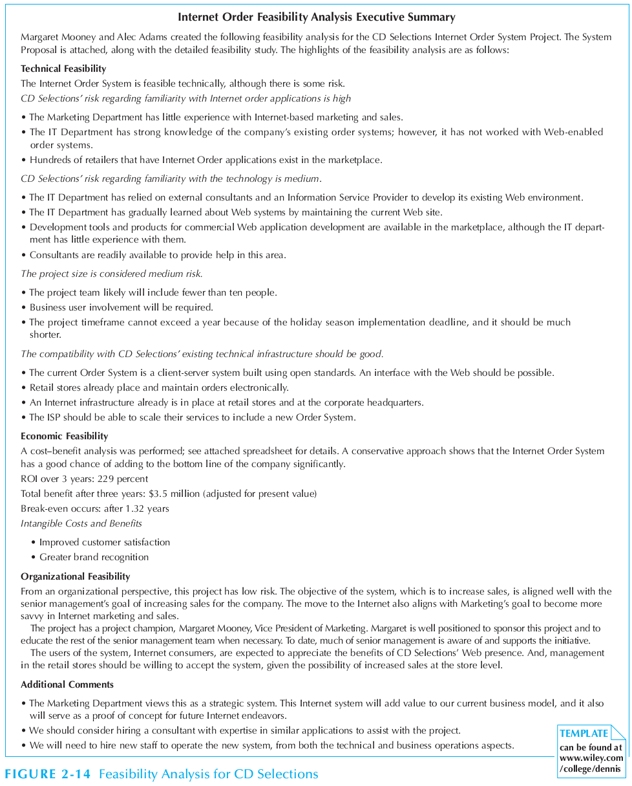
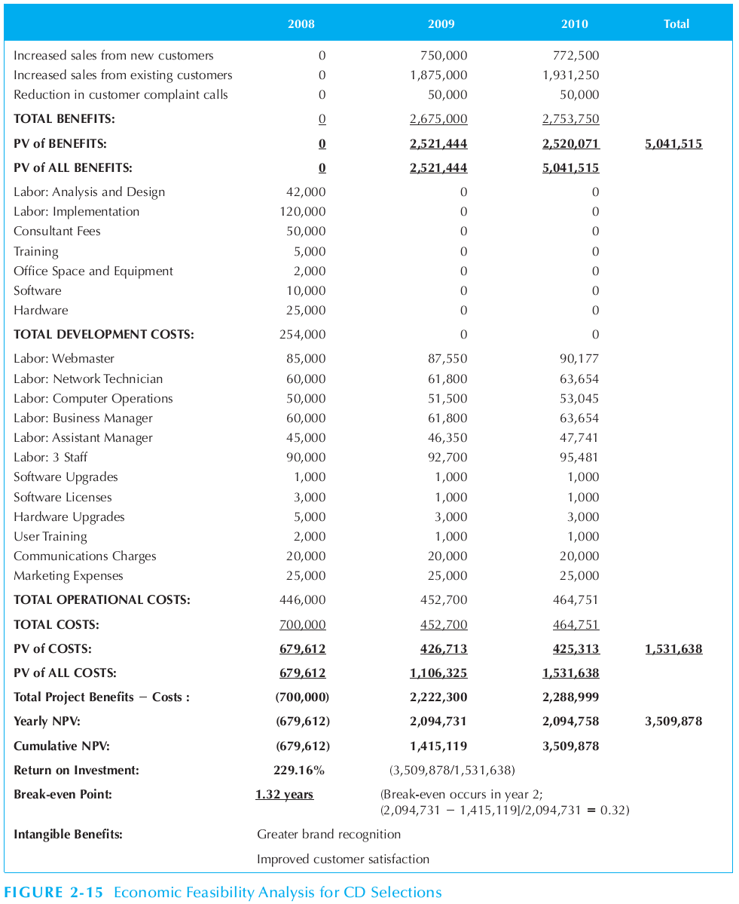

Tổng hợp hình vẽ từ ví dụ về hệ thống lựa chọn CDs
================================================

CHAPTER 1. Introduction to Systems Analysis and Design
------------------------------------------------------

PART ONE. Project Initiation, Project Management, and Requirements Determination
========================================================================

CHAPTER 2. Project Initiation
-----------------------------

CHAPTER 3. Project Management
-----------------------------

CHAPTER 4. Requirements Determination
-------------------------------------

PART TWO. Analysis Modeling
---------------------------

CHAPTER 5. Functional Modeling
------------------------------

CHAPTER 6. Structural Modeling
------------------------------

CHAPTER 7. Behavioral Modeling
------------------------------

PART THREE. Design Modeling
===========================

CHAPTER 8. Moving on to Design
------------------------------

CHAPTER 9. Class and Method Design
----------------------------------

CHAPTER 10. Data Management Layer Design
----------------------------------------

CHAPTER 11. Human–Computer Interaction Layer Design
---------------------------------------------------

CHAPTER 12. Physical Architecture Layer Design
----------------------------------------------

PART FOUR. Construction, Installation, and Operations
=====================================================

CHAPTER 13. Construction
------------------------

CHAPTER 14. Installation and Operations
---------------------------------------

